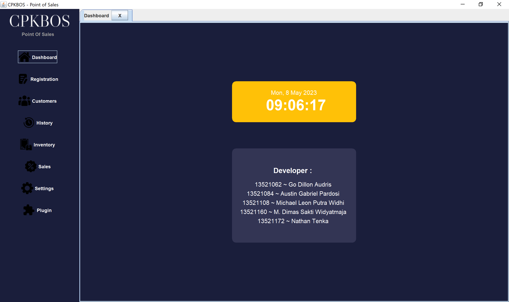

# Point Of Sales - CPKBOS
> Source Code ini dibuat oleh kami, Kelompok CaPeK (CPK), untuk memenuhi Tugas Besar 2 Pemrograman Berorientasi Objek yaitu mengimplementasikan
> Manajemen Usaha BNMO menggunakan konsep Pemrograman Berorientasi Objek

## Daftar Isi
- [Anggota Kelompok](#anggota-kelompok)
- [Implementasi Program](#implementasi-program)
- [Sistematika File](#sistematika-file)
- [Requirements](#requirements)
- [Cara Menjalankan Program](#cara-menjalankan-program)
- [Screenshot](#screenshot)

## Anggota Kelompok
| NIM      | Nama                      |
| -------- | ------------------------- |
| 13521062 | Go Dillon Audris          |
| 13521084 | Austin Gabriel Pardosi    |
| 13521108 | Michael Leon Putra Widhi  |
| 13521160 | M. Dimas Sakti Widyatmaja |
| 13521172 | Nathan Tenka              |

## Implementasi Program
Pada Tugas Besar 2 kali ini, kelompok kami membuat aplikasi Point Of Sales (POS) yang bernama CPKBOS. Aplikasi ini merupakan sebuah aplikasi yang membantu sebuah toko untuk melakukan dan mencatat transaksi yang berhubungan dengan usaha mereka. Aplikasi ini memiliki fitur dasar manajemen inventaris dan manajemen transaksi. Selain itu, program memiliki  fitur membership agar toko dapat memberikan reward kepada pelanggan yang setia, dan juga fitur membership agar toko dapat memberikan reward kepada pelanggan yang setia, dan juga fitur pembuatan laporan untuk mendukung toko dalam melakukan evaluasi. Program juga bersifat extensible dengan menyediakan dukungan plugin, sehingga pengguna dapat menambahkan fungsionalitas program dengan mudah.

## Sistematika File
```bash
.
├─── data
├─── img  
├─── src
│   ├─── main/java/main
│   │   ├─── Barang
│   │   ├─── Bill
│   │   ├─── Client
│   │   ├─── DataStore
│   │   ├─── Laporan
│   │   ├─── Observer
│   │   ├─── Pages
│   │   │   ├─── DashboardPage
│   │   │   ├─── HistoryPage
│   │   │   ├─── InventoryPage
│   │   │   ├─── KasirPage
│   │   │   ├─── PaymentPage
│   │   │   ├─── PluginPage
│   │   │   ├─── RegistrationPage
│   │   │   ├─── SettingsPage
│   │   │   ├─── UpdateInformationPage
│   │   │   └─── Utils.java
│   │   ├─── Plugin
│   │   ├─── Transaksi
│   │   └─── App.java
│   └─── test/java/main
├─── target
├─── .editorconfig
├─── .gitignore
├─── dependecy-reduced-pom.xml
├─── pom.xml
└─── README.md
```

## Requirements
- Java versi 17 atau lebih baru.
- Apache Maven 3.8.4

## Cara Menjalankan Program
1. Lakukan *clone repository* melalui terminal dengan *command* berikut
    ``` bash
    $ git clone https://github.com/mikeleo03/Tubes-2-OOP-CPK.git
    ```
2. Lakukan pembangunan *file* jar dengan *command* berikut.
   ``` bash
    $ mvn clean package
   ```
3. Jika proses pembangunan *file* jar berhasil, maka akan muncul sebuah *file* dengan ekstensi jar pada folder target dengan nama ```TugasBesar2-1.0.jar```. Lakukan pemindahan direktori dan kompilasi dengan menjalankan *command* berikut
   ``` bash
    $ cd target
    $ java -jar TugasBesar2-1.0.jar
   ```
Jika proses kompilasi berhasil, maka Anda akan dihadapkan pada tampilan utama aplikasi. Tekan tombol ```dashboard`` untuk melihat laman utama dari aplikasi.

## Screenshot
